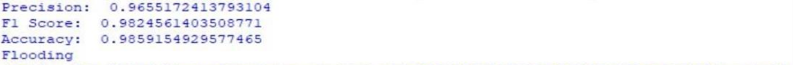

# 🌊 Flash Flood Detection and Alert System using Transfer Learning

This project introduces an efficient flood detection system using **transfer learning** with a pre-trained MobileNet model. It classifies user-submitted images as either **Flooding** or **No Flooding** and triggers real-time alerts if flooding is detected. Designed for fast, lightweight deployment in urban flood scenarios.

---

## 📷 Demo

### ✅ Sample Output


### 📲 Alert Example


---

## 🚀 Project Overview

Users capture and upload images of urban locations during rainfall or storm events. These images are processed through a **MobileNet-based classifier**, fine-tuned using transfer learning to detect flood conditions. If a flooding situation is identified, the system sends out SMS alerts via the Twilio API.

---

## 🔍 Key Features

- ✅ Flood classification using **MobileNet + Transfer Learning**
- 🧠 Binary output: **Flooding** / **No Flooding**
- 💡 Fast inference even on low-end hardware (CPU only)
- 📲 Twilio SMS integration for real-time alerts
- 📦 Lightweight and easily deployable

---

## 🧠 Tech Stack

- Python
- TensorFlow + Keras (Transfer Learning)
- Scikit-learn (evaluation)
- Twilio API (alerts)
- matplotlib, pandas for visualization and data handling

---

## 🛠️ Requirements

Install all dependencies with:

```bash
pip install -r requirements.txt
